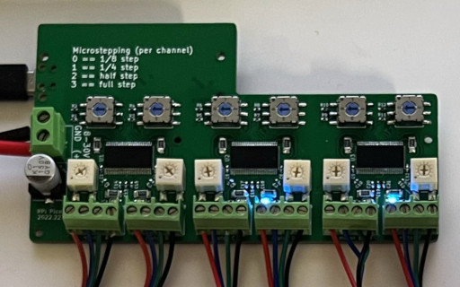
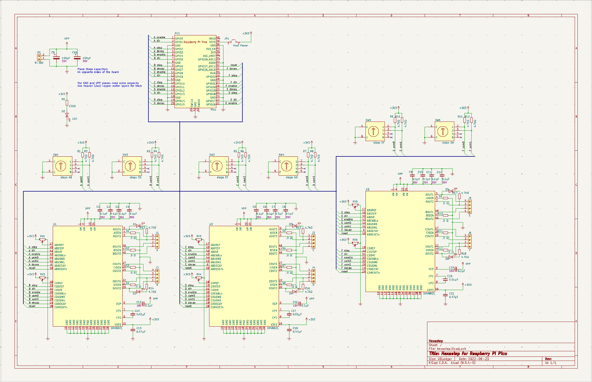

6-axis stepper driver for **Raspberry Pi Pico**

The **Raspberry Pi Pico** is on the back side of this board

# Prerequisites
* KiCad 6.0+
* load symbols and footprints.  The schematic and PCB depend on the library located in `/libs`, which needs to be added before opening the schematics/pcb in KiCad:
  * symbols: **KiCad** -> **Preferences** -> **Manage Symbol Libraries...**,
  * footprints: **KiCad** -> **Preferences** -> **Manage Footprint Libraries...**
* PCB manufacturing: any manufacturer capable of 4-layer and 0.4mm vias -- pretty much any PCB shop

# Schematic
  (also in [PDF](docs/schematic-v1.pdf))

# Parts
https://octopart.com/bom-tool/PoB5E81H

# Footnotes
the photo at the top of this page is of a previous version of the board.  The current version has:
  * a slightly different layout
  * a power LED
  * a jumper for powering R-Pi Pico
  * better filtering.
